# Major Project Defense Guide

Project title:

> A Multi-Model Multi-Stage Framework for Heart Disease Prediction Using Intelligent Feature Fusion and Risk Modelling

Current status:

- Phase-1 Completed
- Phase-2 In Progress

Purpose of this document:

> The final document should help me defend MY contribution confidently during placement interviews.

This guide uses simple English. When a technical term is used, the meaning is given near it or in the Terminology section.

---

## 1. Exact Sentences To Memorize

Use these lines exactly in viva, reviews, and placement interviews.

### One-Line Project Explanation

> Our project is a multi-modal AI framework that integrates echo data, ECG signals, and clinical parameters to perform multi-stage heart disease prediction with risk percentage and advisory report generation.

### Problem Statement

> Current models provide only binary outputs without stage-level severity, risk percentage, or intelligent advisory reporting.

> This gap highlights the need for a comprehensive, multi-modal AI-based cardiac assessment framework capable of stage-wise severity analysis and risk modelling.

### Research Gap

Gap = No multi-modal + no multi-stage + no fusion + no advisory.

### Proposed System

> We propose a Multi-Modal Multi-Stage Heart Disease Prediction Framework that integrates heterogeneous cardiac data sources into a unified intelligent decision-making system.

> The proposed framework mimics real-world cardiology decision workflows by combining structural, electrical, and clinical cardiac indicators.

### Your Contribution

> My contribution was mainly in Fusion, System Integration, Architecture, Pipeline Design, Explainability, and RAG.

Use this if they ask what you personally did:

> I integrated independently developed models into a unified working system.

Use this if they ask what your pipeline does:

> I designed and implemented the complete system pipeline responsible for:

- Agent execution flow
- Data movement between modules
- Shared memory communication
- Fusion execution
- Final output generation

Use this if they ask about explainability:

> I designed the explainability workflow that generates:

- Summary
- Detailed reasoning
- Recommendation

Use this if they ask about RAG:

> I implemented and integrated RAG-related components including:

- Retriever
- Rule Engine
- Generator

for explanation and reasoning generation.

---

## 2. Team And Individual Contributions

### Team Contributions

This is a college major project being developed by a team.

Different teammates worked on different machine learning models.

The team-level system includes:

- Echo Module for echocardiography video/image analysis.
- ECG Module for ECG signal analysis.
- Clinical Module for structured patient data analysis.
- Fusion Module for final risk prediction.
- Explainability and report generation workflow.
- Review-1 and Review-2 architecture, flowcharts, and system design.

### Individual Contributions

Do not say that one person built everything. Your individual contribution should be explained like this:

> Created the complete project structure and repository organization.

> Designed the high-level architecture.

> Defined standardized input/output schemas.

> Designed the Shared Memory communication layer.

> Developed the Fusion Module.

> I integrated independently developed models into a unified working system.

> I performed end-to-end testing using:

- Echo inputs
- ECG outputs
- Clinical predictions

to validate the complete pipeline.

---

## 3. Team Leader Module Explanation

Even if you did not personally build every model, as a team leader you should be able to explain what each module does, why it exists, what input it takes, what model logic it uses, what output it gives, and how it connects to Fusion.

Safe sentence to use:

> As a team leader, I can explain the purpose, input, output, and integration role of each module, while clearly separating my individual contribution from my teammates' model-specific implementation work.

### 3.1 Echo Module Explanation

Exact PPT reference:

> Echo Agent processes echocardiography video/image data. Extracts structural cardiac features and classifies severity.

Simple explanation:

The Echo Module studies heart structure and movement using echocardiography data. Echocardiography means ultrasound video or image of the heart. This module helps the system understand structural problems, such as weak pumping or abnormal heart motion.

Input:

- Echocardiography video or image.
- In the current pipeline, the user can provide an Echo video path.

Model used:

- CNN.

Meaning of CNN:

CNN means Convolutional Neural Network. It is a deep learning model that is good at reading images and videos because it can detect visual patterns.

Why CNN is suitable for Echo:

Echo data contains visual and motion-based information. CNN models are useful because they can learn patterns from image frames, such as heart chamber movement, shape, and structural features.

Output:

- Severity Stage or Risk Level.
- Confidence Score.

Example output from PPT:

- Stage: Low / Medium / High + Score.
- Sample output: Medium severity (0.39).

Role in the whole system:

The Echo Module gives structural cardiac information to the Fusion Module. It answers the question: "What does the heart structure and motion indicate?"

How to explain in viva:

> The Echo Agent handles structural cardiac information. It processes echocardiography video or image data using CNN-based feature extraction and gives a severity level with confidence score. This output is then passed to the Fusion Module.

Echo limitations:

- Echo videos can be large and computationally heavy.
- Video quality may affect prediction.
- More medical validation is needed before clinical deployment.
- In Phase-2, performance can be improved using better feature extraction and larger datasets.

Echo follow-up questions:

Q: What is Echocardiography?

A: Echocardiography is an ultrasound-based heart scan. It shows heart structure and movement.

Follow-up: Why is Echo useful in heart disease prediction?

A: Echo helps detect structural cardiac problems, such as abnormal heart motion or weak pumping, which may not be visible from clinical data alone.

Q: Why did your team use CNN for Echo?

A: CNN is suitable because Echo data is image/video-based. CNN can learn visual patterns from frames and use them for severity classification.

Follow-up: What does the Echo output contain?

A: It contains severity stage or risk level and confidence score.

Q: Did you personally build the Echo model?

A: No, the Echo model-specific work was handled as part of the team. My role was to integrate its structured output into the common system pipeline and Fusion Module.

Follow-up: Then why can you explain it?

A: As team leader and system integrator, I need to understand every module's input, output, purpose, and integration role, even if the detailed model development was done by teammates.

### 3.2 ECG Module Explanation

Exact PPT reference:

> ECG Agent analyzes 12-lead ECG signals. Classifies rhythm patterns (NORM, MI, STTC, CD, HYP).

Simple explanation:

The ECG Module studies the electrical activity of the heart. ECG means Electrocardiogram. It records heart rhythm using electrical signals. This module helps detect rhythm abnormalities and electrical signs of cardiac conditions.

Input:

- ECG signal data.
- In the current pipeline, the ECG input is required and can be a `.csv` file or ECG image path.

Dataset reference from PPT:

- PTB-XL.
- 12-lead ECG Signal.
- 21,837 records.
- 5 classes: NORM, MI, STTC, CD, HYP.

Meaning of ECG classes:

- NORM: Normal ECG.
- MI: Myocardial Infarction, meaning heart attack-related pattern.
- STTC: ST/T Change, meaning changes in ECG wave segments.
- CD: Conduction Disturbance, meaning electrical signal movement problem.
- HYP: Hypertrophy, meaning thickening/enlargement-related pattern.

Model / technique used:

- CNN-based ECG model in the codebase.
- Random Forest / CNN is mentioned in the PPT.
- Temperature scaling calibration is used.

Meaning of calibration:

Calibration means making confidence scores more realistic. If the model says 80% confidence, it should behave close to 80% correctness in practice.

Output:

- Rhythm class.
- Risk level.
- Confidence score.
- Reason, such as ECG pattern shows ST/T change features.

Role in the whole system:

The ECG Module gives electrical rhythm information to the Fusion Module. It answers the question: "What does the heart's electrical activity indicate?"

How to explain in viva:

> The ECG Agent analyzes 12-lead ECG signals and classifies rhythm patterns such as NORM, MI, STTC, CD, and HYP. It produces a risk level, confidence score, and reason, which are passed to the Fusion Module.

ECG limitations:

- ECG signals can be noisy.
- Image-to-signal conversion can introduce errors if ECG image quality is poor.
- Class imbalance can affect model performance.
- Real-time ECG integration is planned for Phase-2.

ECG follow-up questions:

Q: What is ECG?

A: ECG means Electrocardiogram. It records the electrical activity of the heart.

Follow-up: Why is ECG important?

A: ECG helps detect rhythm abnormalities and electrical changes that may indicate heart disease.

Q: What are the ECG classes used in the project?

A: The classes are NORM, MI, STTC, CD, and HYP.

Follow-up: What do those classes mean?

A: NORM means normal ECG, MI means myocardial infarction, STTC means ST/T change, CD means conduction disturbance, and HYP means hypertrophy.

Q: Why is calibration used in ECG?

A: Calibration improves confidence reliability. It helps the model's confidence score better match actual correctness.

Q: Did you personally build the ECG model?

A: No, the ECG model-specific implementation was team work. My contribution was to integrate the ECG output into the standardized pipeline, Fusion Module, and explanation workflow.

### 3.3 Clinical Module Explanation

Exact PPT reference:

> Clinical Agent uses clinical indicators (like age, BP, cholesterol). Predicts Low / Medium / High risk.

Simple explanation:

The Clinical Module uses structured patient health data. Structured data means values arranged in fixed fields, such as age, blood pressure, cholesterol, glucose, smoking, alcohol, and activity. This module predicts overall clinical risk.

Input:

- Age.
- Gender.
- Height.
- Weight.
- Systolic BP.
- Diastolic BP.
- Cholesterol.
- Glucose.
- Smoking.
- Alcohol.
- Physical activity.

Feature engineering:

The code creates BMI from height and weight.

Meaning of BMI:

BMI means Body Mass Index. It is calculated using height and weight and gives an estimate of body weight category.

Model used:

- Stacking Ensemble.
- RF + LightGBM + SVC.
- Meta-learner: Logistic Regression.

Meaning of Stacking Ensemble:

Stacking Ensemble means using multiple models and then passing their outputs to a final model called a meta-learner.

Output:

- Risk: Low / Medium / High.
- Confidence score.
- Reason based on clinical indicators.

Performance from PPT:

- Accuracy: 77.75%.
- ROC-AUC: 0.9103.

Role in the whole system:

The Clinical Module gives patient health-factor information to the Fusion Module. It answers the question: "What do the patient's clinical risk factors indicate?"

How to explain in viva:

> The Clinical Agent uses structured patient data such as age, blood pressure, cholesterol, glucose, BMI, and lifestyle indicators. It uses a stacking ensemble model to predict Low, Medium, or High risk with confidence score.

Clinical limitations:

- Clinical data depends on correct user input.
- Dataset bias can affect prediction.
- It does not directly observe heart structure or rhythm.
- That is why it is combined with Echo and ECG.

Clinical follow-up questions:

Q: What is clinical data?

A: Clinical data means patient health parameters such as age, blood pressure, cholesterol, glucose, height, weight, smoking, alcohol, and physical activity.

Follow-up: Why is clinical data important?

A: Clinical data captures risk factors that are strongly related to heart disease.

Q: Why is Clinical Weight 40% in Fusion?

A: Clinical parameters are strong indicators of overall heart disease risk, so the clinical module is given slightly higher weight than Echo and ECG in Phase-1.

Q: What is stacking in the Clinical Module?

A: Stacking is an ensemble method where multiple models such as Random Forest, LightGBM, and SVC give outputs, and a final model uses them to make the final prediction.

Follow-up: What is the meta-learner?

A: The meta-learner is the final model in stacking. In this project, Logistic Regression is used as the meta-learner.

Q: Did you personally build the Clinical model?

A: No, the clinical model-specific work was handled as part of team development. My role was to standardize and integrate its output with the system pipeline and Fusion Module.

### 3.4 How The Three Modules Work Together

Exact PPT reference:

> Each agent operates independently with standardized input/output format enabling modular development and parallel execution.

Simple explanation:

Echo, ECG, and Clinical modules each look at the patient from a different angle:

- Echo looks at heart structure and motion.
- ECG looks at electrical rhythm.
- Clinical looks at patient risk factors.

Together, they create a more complete prediction than a single module.

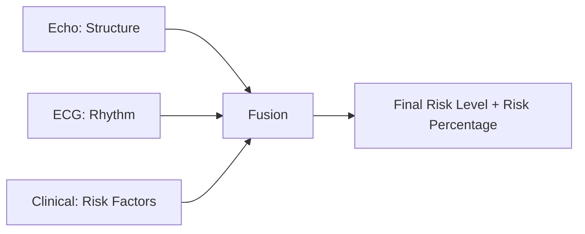

Team leader answer:

> As a team leader, I should understand all three modules because the final system depends on their integration. My main contribution is not claiming that I built every model, but ensuring that independently developed models communicate through a common pipeline and produce a unified final output.

Follow-up questions:

Q: Why do you need three modules?

A: Heart disease is complex. One data source may miss important information. Echo, ECG, and Clinical data together give structural, electrical, and health-factor views of the patient.

Q: What happens if the modules disagree?

A: Fusion handles disagreement using weighted and confidence-based scoring. The final output depends on module risk level, module weight, and confidence score.

Q: What happens if one module is missing?

A: The system is modular, so it can still work with available inputs, but full multi-modal input gives better reliability.

---

## 4. Current Implementation

This section describes what is already implemented in the codebase.

### Current Modules

1. Echo Agent
   - Input: Echo video path, or skipped input if not available.
   - Output: level, score, source, and error/reason if present.
   - Meaning: It gives structural heart information.

2. ECG Agent
   - Input: ECG `.csv` file or ECG image path.
   - Output: level, score, and reason.
   - Meaning: It gives electrical rhythm information.

3. Clinical Agent
   - Input: age, gender, height, weight, blood pressure, cholesterol, glucose, smoking, alcohol, and activity.
   - Output: Low, Medium, or High risk with score.
   - Meaning: It gives health-parameter-based risk.

4. Fusion Agent
   - Input: outputs from Echo, ECG, and Clinical agents.
   - Output: final risk level and risk percentage.
   - Meaning: It combines all model outputs into one final decision.

5. RAG / Explainability Components
   - Retriever collects reasons from agents.
   - Rule Engine applies if-then medical reasoning rules.
   - Generator creates final explanation structure.

### Current Fusion Logic

Fusion Logic:

- Echo Weight = 30%
- ECG Weight = 30%
- Clinical Weight = 40%

In code, Low is mapped to 1, Medium is mapped to 2, and High is mapped to 3.

The system multiplies each module level by its fixed module weight and confidence score. Then it calculates the final score and converts it into:

- Final Risk Level
- Risk Percentage

Exact sentence:

> The Fusion Module combines outputs from all models and generates:

- Final Risk Level
- Risk Percentage

### Current Pipeline Flow

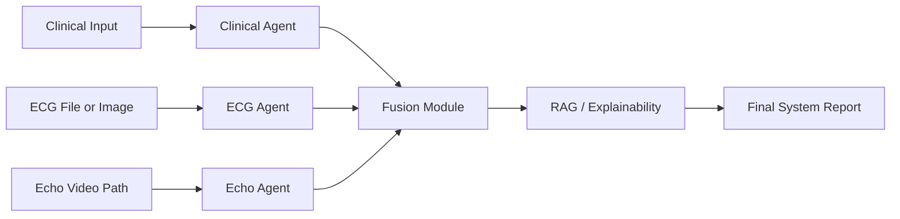

Step-by-step:

1. The user enters clinical values.
2. The user provides an ECG file path.
3. The user provides an Echo video path, or skips it.
4. Each agent produces a structured output.
5. Fusion combines the three outputs.
6. RAG / Explainability generates summary and details.
7. The final report prints risk level, risk percentage, summary, and details.

---

## 5. Future Phase-2 Architecture

This section describes planned future features. Do not present these as fully completed.

Future Work from Review-2:

- Medical-document-based Retrieval Augmented Generation for intelligent explanations and evidence-backed recommendations.
- Patient-specific digital twin simulation for real-time cardiac monitoring and predictive modeling.
- Generate separate Doctor report (technical) and Patient report (simplified) from the same prediction pipeline.
- Adaptive input system with real-time 12-lead ECG signal integration replacing simulated inputs.
- Interactive dashboard (Streamlit/React) for easy interaction, visualization, and report download.
- Cloud deployment with API endpoints.
- Model optimization via hyperparameter tuning for production-grade reliability.

Future Phase-2 flow:

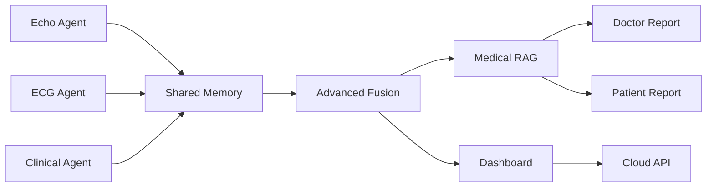

Simple explanation:

In Phase-2, the system can become more production-ready. The current CLI can be extended into a dashboard and API. RAG can use medical documents to generate stronger recommendations. Doctor and patient reports can be generated separately.

---

## 6. Machine Learning Concepts

### Classification

Classification means assigning input data to a category. Example: Low risk, Medium risk, or High risk.

### Multi-Class Classification

Multi-Class Classification means choosing one class from more than two possible classes. Example: NORM, MI, STTC, CD, HYP in ECG classification.

### Ensemble Learning

Ensemble Learning means combining multiple models to get a better prediction than a single model. Example: Random Forest + LightGBM + SVC.

### Stacking

Stacking is an ensemble method where outputs from multiple base models are given to a final model called a meta-learner. In this project, Logistic Regression can act as the meta-learner.

### CNN

CNN means Convolutional Neural Network. It is a deep learning model used mainly for images and videos. It detects patterns such as shapes, edges, and motion features.

### Random Forest

Random Forest is a machine learning model made of many decision trees. It is useful for tabular data.

### XGBoost

XGBoost is a powerful boosting model. Boosting means models are trained step-by-step, where each new model tries to fix previous errors.

### LightGBM

LightGBM is a fast boosting model used for tabular data. It is useful when the dataset has many rows or features.

### SVC

SVC means Support Vector Classifier. It separates classes using a boundary.

### Logistic Regression

Logistic Regression is a simple classification model. It can also be used as a meta-learner in stacking.

### ROC-AUC

ROC-AUC is a model evaluation score. It tells how well the model separates classes. Higher ROC-AUC is better.

### Accuracy

Accuracy means how many predictions are correct out of all predictions.

### Calibration

Calibration means making the model confidence more realistic. Example: if a model says 80% confidence, it should be correct around 80% of the time.

### Feature Engineering

Feature Engineering means creating useful input values from raw data. Example: BMI from height and weight.

### Feature Fusion

Feature Fusion means combining features or outputs from different sources.

### Model Evaluation

Model Evaluation means checking model performance using metrics like Accuracy, ROC-AUC, Precision, Recall, F1-score, and confusion matrix.

---

## 7. Multi-Modal AI

### What Is Multi-Modal AI?

Multi-Modal AI means using more than one type of data. In this project, the modalities are:

- Echo data: structural heart information.
- ECG data: electrical rhythm information.
- Clinical data: patient health parameters.

### Why Combine Echo, ECG, And Clinical Data?

Exact sentence:

> In real clinical practice, doctors do not rely on one test. They combine structural information, electrical rhythm, and clinical history. Similarly, multi-modal integration improves accuracy and reliability compared to single-modality models.

### Benefits Over Single-Model Systems

- More complete view of the patient.
- Better decision-making.
- Lower dependency on one data source.
- More reliable final risk prediction.
- Closer to real cardiology workflow.

---

## 8. Feature Fusion

### What Feature Fusion Is

Feature Fusion means combining information from different models or data sources into one final decision.

In this project, fusion combines:

- Echo output
- ECG output
- Clinical output

### Why Fusion Is Needed

Fusion is needed because heart disease is not explained by only one signal. Echo shows structure, ECG shows rhythm, and clinical data shows patient risk factors.

### Types Of Fusion

1. Early Fusion
   - Raw features are combined before model prediction.
   - Meaning: data is joined at the beginning.

2. Late Fusion
   - Final predictions are combined after each model predicts.
   - Meaning: decisions are joined at the end.

3. Hybrid Fusion
   - Uses both early and late fusion ideas.

### Weighted Fusion

Weighted Fusion means each module gets a fixed importance value.

In this project:

- Echo Weight = 30%
- ECG Weight = 30%
- Clinical Weight = 40%

Clinical has higher weight because clinical risk factors are strong indicators for overall patient risk.

### Confidence-Based Fusion

Confidence-Based Fusion means the model confidence score affects the final result. If a module has higher confidence, its output has stronger influence.

### Fusion Challenges

- Different modules may disagree.
- One modality may be missing.
- Confidence scores may not always be calibrated.
- Medical data can be noisy.
- Fusion logic must be explainable.

### Fusion Interview Questions

Q: What is the role of the Fusion Module?

A: The Fusion Module combines outputs from all models and generates Final Risk Level and Risk Percentage.

Follow-up: Why did you use weighted fusion?

A: Weighted fusion is simple, explainable, and suitable for Phase-1. It clearly shows how Echo, ECG, and Clinical outputs contribute to the final decision.

Q: Why is Clinical Weight 40%?

A: Clinical parameters such as blood pressure, cholesterol, age, glucose, and lifestyle are strong risk indicators. So clinical output is given slightly higher importance.

Follow-up: Can the weights change in future?

A: Yes. In Phase-2, the fixed weights can be replaced with learning-based fusion or dynamically learned weights.

---

## 9. Shared Memory Architecture

### What Shared Memory Means In This Project

Exact sentence:

> Shared Memory is a feature fusion layer where outputs from independent models - echo, ECG, and clinical - are combined before final prediction. It allows contextual decision making.

In the codebase, Shared Memory is represented as a centralized dictionary-like structure that stores module outputs.

### Why It Was Used

Shared Memory was used because each agent works independently. Instead of tightly connecting every model to every other model, all agents can write their outputs to one common place.

### Current Shared Memory Design

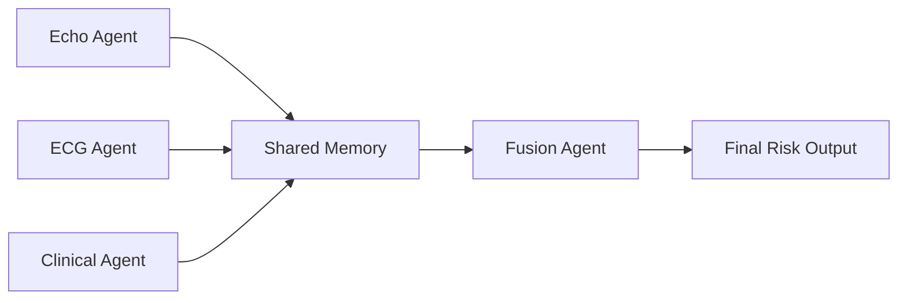

Shared memory stores:

- echo: level, score, reason/source
- ecg: level, score, reason
- clinical: level, score, reason

### Advantages

- Modular design.
- Easy to integrate independently developed models.
- Cleaner communication between agents.
- Scalable for future modules.
- Supports debugging because each module output can be checked separately.

### Limitations

- If not managed carefully, stale data can remain in memory.
- It is currently simple and in-memory, so it is not yet production-grade.
- It does not automatically handle concurrency, failures, or distributed systems.

### Alternative Designs

1. Direct Function Calls
   - Simple, but tightly couples modules.

2. Message Queue
   - Better for production, but more complex.

3. Database
   - Good for persistence, but slower and heavier.

4. API-Based Microservices
   - Good for deployment, but needs network and service management.

### Shared Memory Interview Questions

Q: Why did you choose Shared Memory?

A: Shared Memory provides a simple communication layer between independent agents. It allows Echo, ECG, and Clinical outputs to be stored in one place before Fusion reads them.

Follow-up: Is this the same as operating system shared memory?

A: No. In this project, Shared Memory means a project-level shared data structure. It is not low-level operating system shared memory.

Q: What does Shared Memory store?

A: It stores structured outputs from all agents, mainly level, score, and reason.

---

## 10. Explainable AI

### Explainability

Explainability means the system can explain why it gave a prediction.

### Model Interpretability

Model Interpretability means humans can understand the model behavior or decision factors.

### Rule-Based Reasoning

Rule-Based Reasoning means using if-then rules to create explanations. Example: if Clinical is High, summary becomes "High risk driven by clinical factors".

### Attribution

Attribution means showing which input or module contributed to the final result.

### Confidence Scores

Confidence Score means how sure the model is about its prediction.

### Medical AI Explainability

Medical AI needs explainability because doctors and patients cannot rely only on a black-box output. They need reasons, risk factors, and next-step suggestions.

### Current Explainability Pipeline

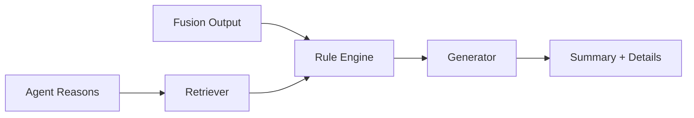

Current explanation examples from code:

- High risk due to both structural and electrical abnormalities
- High risk driven by clinical factors
- Elevated risk due to ECG abnormalities
- Elevated risk due to structural heart issues
- Moderate risk due to mixed indicators
- Low risk with no major abnormalities

### Explainability Interview Questions

Q: What does your explainability workflow generate?

A: It generates Summary, Detailed reasoning, and Recommendation.

Follow-up: Is the explanation generated by a large language model?

A: In the current implementation, explanation is mainly rule-based and structured. In Phase-2, medical-document-based RAG can make the recommendations more evidence-backed.

---

## 11. RAG Architecture

### What Is RAG?

RAG means Retrieval Augmented Generation.

Retrieval means finding relevant information from a knowledge base.

Generation means creating a response or explanation.

So, RAG means generating answers using retrieved information.

### Why RAG Is Used

RAG is used to make explanations and recommendations more informative. In medical AI, it can help connect the model output with known medical guidance.

### Current RAG Version

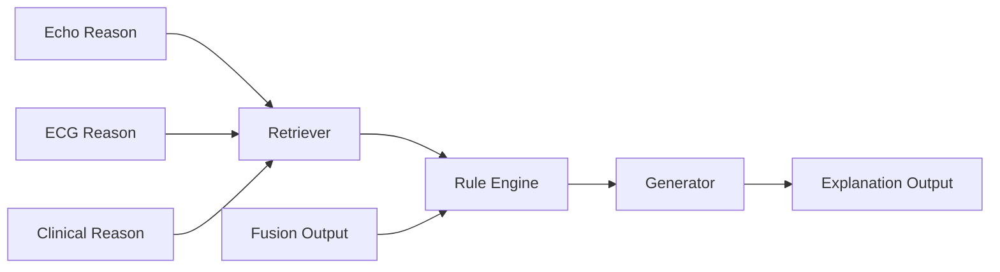

Current components:

- Retriever: extracts reasoning from all agents.
- Rule Engine: applies logic based on agent levels.
- Generator: builds the final explanation object.

### Future RAG Version

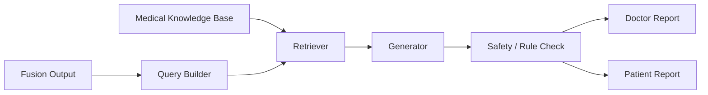

Future components:

- Knowledge Base: trusted medical documents.
- Retriever: finds relevant medical content.
- Generator: creates the explanation.
- Safety / Rule Check: prevents unsafe or unsupported advice.

### Medical Recommendation Generation

Current recommendation generation is basic and rule-based. Future recommendation generation can use RAG to produce stronger doctor-level and patient-level reports.

### RAG Interview Questions

Q: What is RAG in your project?

A: RAG stands for Retrieval Augmented Generation. In our project, it supports explanation and reasoning generation by using retrieved insights and rule-based logic.

Follow-up: Is RAG fully production-ready now?

A: No. The current version has Retriever, Rule Engine, and Generator components. A full medical-document-based RAG system is part of Phase-2 future enhancement.

---

## 12. Architecture Diagrams

The Review-1 and Review-2 PPTs are the primary reference for architecture, flowcharts, shared memory design, agent workflow, and system diagrams.

### A. High-Level Architecture

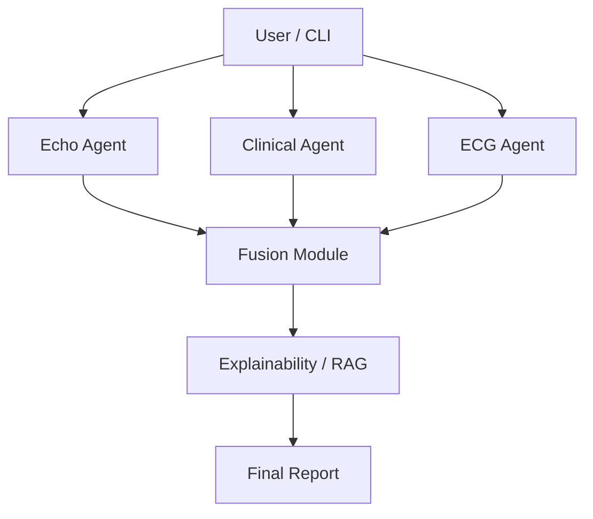

Why each component exists:

- User / CLI collects input.
- Echo Agent handles structural cardiac data.
- ECG Agent handles electrical rhythm data.
- Clinical Agent handles patient health parameters.
- Fusion Module combines the outputs.
- Explainability / RAG explains the result.
- Final Report presents the answer clearly.

### B. Detailed Agent Architecture

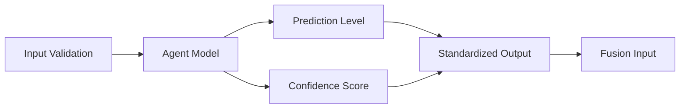

Explanation:

Each agent follows the same pattern: validate input, run prediction, calculate confidence, and return standardized output.

### C. Shared Memory Architecture

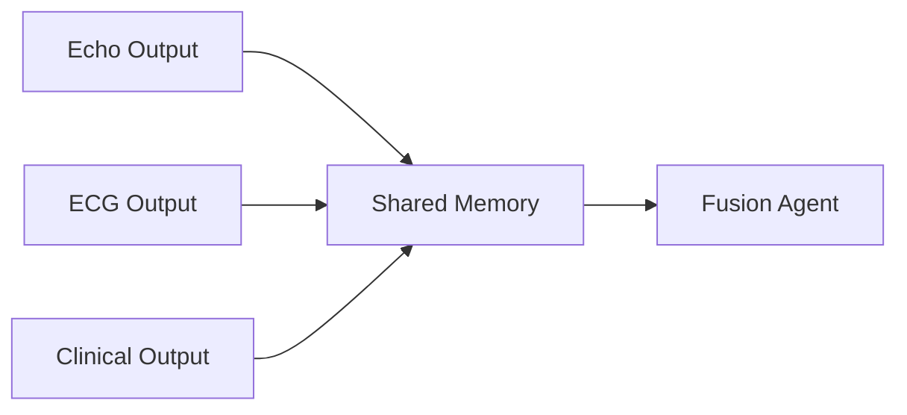

Explanation:

Shared Memory acts as a communication bus. It keeps independent agent outputs available for Fusion.

### D. Fusion Architecture

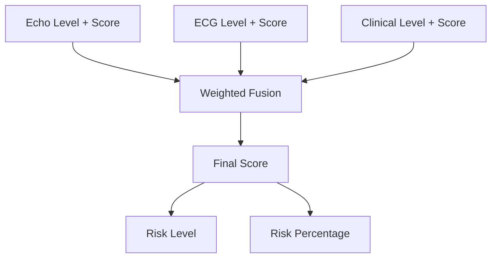

Explanation:

Fusion converts Low, Medium, and High into numeric values. Then it applies module weights and confidence scores.

### E. Explainability Pipeline Architecture

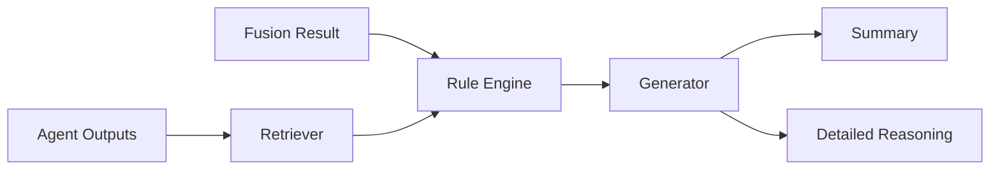

Explanation:

The system does not stop at risk prediction. It also explains why the prediction was made.

### F. RAG Architecture - Current And Future

Current:

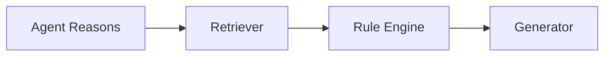

Future:

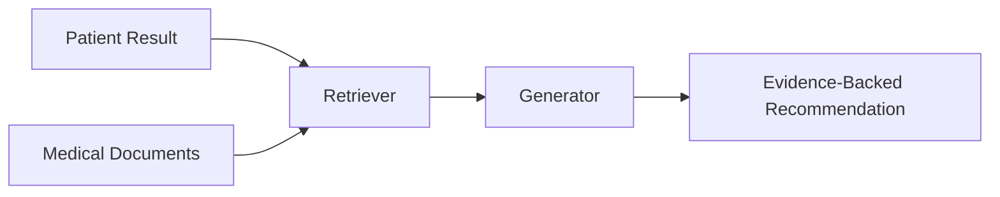

### G. End-To-End Execution Flow

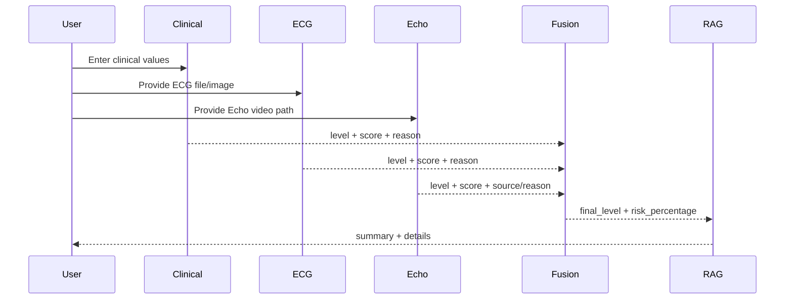

### H. Deployment Architecture - Current And Future

Current:

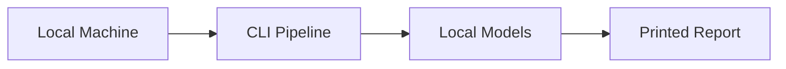

Future:

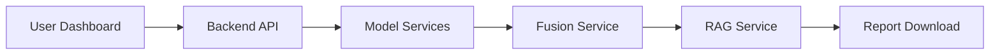

### I. Production Architecture - Future Scalable Version

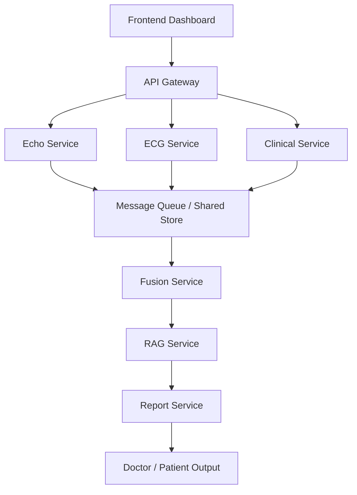

Production meaning:

Production means a real deployed system used by users, not only a local prototype.

---

## 13. Student Contribution Defense

### Fusion Questions

Q: What exactly did you build in Fusion?

A: I developed the Fusion Module. It combines Echo, ECG, and Clinical outputs using weighted fusion and generates Final Risk Level and Risk Percentage.

Follow-up: Why not train a separate fusion neural network?

A: For Phase-1, weighted fusion is better because it is explainable, simple to test, and easy to defend. A trained fusion model can be added in Phase-2 when more aligned multi-modal data is available.

Q: How does confidence affect Fusion?

A: Each module output has a score. The Fusion Module uses that score along with fixed weights, so higher confidence has more influence.

### Integration Questions

Q: What was your integration work?

A: I integrated independently developed models into a unified working system.

Follow-up: What does integration mean here?

A: Integration means connecting separate Echo, ECG, and Clinical modules so that their outputs can move through the same pipeline and produce one final result.

Q: What does your system pipeline handle?

A: It handles agent execution flow, data movement between modules, shared memory communication, fusion execution, and final output generation.

### Shared Memory Questions

Q: What is Shared Memory in your architecture?

A: Shared Memory is a feature fusion layer where outputs from independent models - echo, ECG, and clinical - are combined before final prediction. It allows contextual decision making.

Follow-up: Why is it important?

A: It keeps the system modular. Each agent can work independently, and Fusion can read all outputs from one common place.

### Explainability Questions

Q: What did you do for explainability?

A: I designed the explainability workflow that generates Summary, Detailed reasoning, and Recommendation.

Follow-up: How does the system explain the result?

A: It uses agent reasons and rule-based logic to generate a plain-language explanation.

### RAG Questions

Q: What RAG components did you implement?

A: I implemented and integrated RAG-related components including Retriever, Rule Engine, and Generator for explanation and reasoning generation.

Follow-up: What is future RAG work?

A: In Phase-2, RAG can use medical documents as a knowledge base to generate evidence-backed doctor and patient reports.

---

## 14. Strong Interview Answers

Q: How is your system different from existing systems?

A:

> Most existing systems focus on single modality and binary output. Our system integrates multiple modalities, performs stage-wise classification, calculates risk percentage, and generates an advisory report.

Q: Why multi-modal? Why not just one dataset?

A:

> In real clinical practice, doctors do not rely on one test. They combine structural information, electrical rhythm, and clinical history. Similarly, multi-modal integration improves accuracy and reliability compared to single-modality models.

Q: What is Multi-Stage Classification?

A:

> Instead of predicting only disease or no disease, we classify severity into stages like Stage 1 to Stage 4. This helps in understanding progression and early intervention.

Q: What challenges do you expect?

A:

> Data imbalance, modality synchronization, feature fusion complexity, and computational requirements are expected challenges.

Q: Is this clinically deployable?

A:

> At this stage, it is a research prototype. Clinical deployment would require medical validation and regulatory approval.

Q: What if one modality is missing?

A:

> Our architecture is modular. If one modality is unavailable, the system can still generate prediction using available inputs, though full integration improves accuracy.

---

## 15. Terminology

- AI: Artificial Intelligence. A system that performs tasks that normally need human intelligence.
- ML: Machine Learning. A method where a computer learns patterns from data.
- Deep Learning: A type of ML that uses neural networks with many layers.
- Modality: A type or source of data, such as Echo, ECG, or clinical data.
- Echo: Echocardiography. It is an ultrasound-based heart scan.
- ECG: Electrocardiogram. It records the electrical activity of the heart.
- Clinical Data: Patient health values such as age, blood pressure, cholesterol, glucose, and lifestyle.
- Agent: A module that performs one specific task independently.
- Pipeline: The step-by-step flow of data from input to final output.
- Fusion: Combining outputs from different models.
- Shared Memory: A common storage layer used by modules to exchange outputs.
- RAG: Retrieval Augmented Generation. It retrieves information and uses it to generate explanations.
- Retriever: The part that collects relevant information.
- Rule Engine: The part that applies if-then logic.
- Generator: The part that creates the final explanation.
- Confidence Score: How sure a model is about its prediction.
- Risk Percentage: A percentage estimate of overall risk.
- Calibration: Adjusting confidence so it better matches real correctness.
- ROC-AUC: A score that measures how well a model separates classes.
- Meta-Learner: A final model that learns from outputs of other models.
- Production: A real deployed version used by real users.

---

## 16. Safe Way To Present Current And Future Work

Say this for current work:

> Currently, the system has independent Echo, ECG, Clinical, Fusion, and explanation components connected through an end-to-end pipeline.

Say this for Phase-2:

> In Phase-2, we plan to improve the system with medical-document-based RAG, dashboard interface, real-time ECG support, doctor and patient reports, cloud deployment, and production-level reliability.

Do not say:

- The system is clinically approved.
- The system replaces doctors.
- All future Phase-2 features are already completed.
- One person built all modules.

Best closing line:

> This project is a research prototype that demonstrates how multi-modal AI, feature fusion, and explainability can be combined for heart disease risk prediction.
